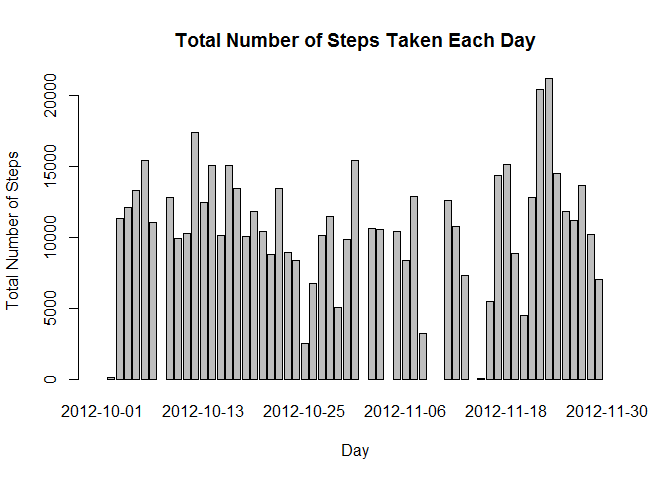
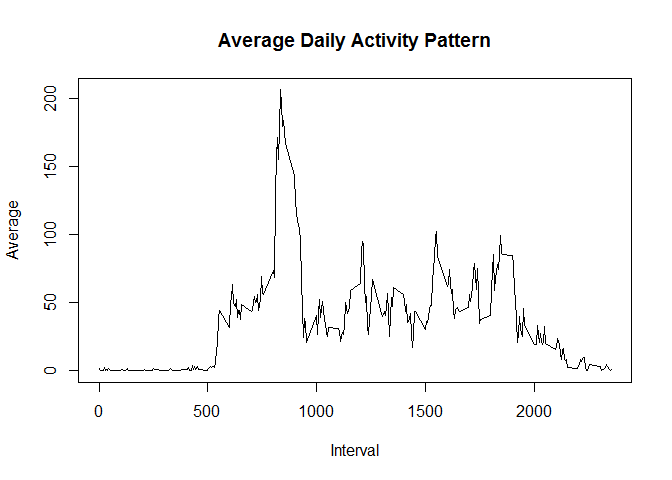
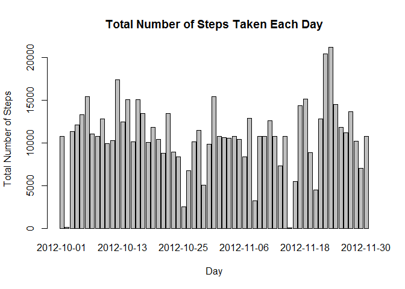
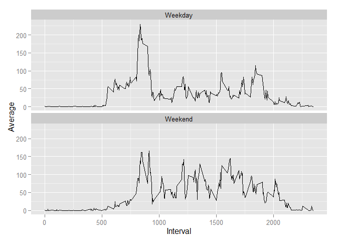

# Reproducible Research: Peer Assessment 1

It is now possible to collect a large amount of data about personal movement using activity monitoring devices such as a Fitbit, Nike Fuelband, or Jawbone Up. These type of devices are part of the "quantified self" movement - a group of enthusiasts who take measurements about themselves regularly to improve their health, to find patterns in their behavior, or because they are tech geeks. But these data remain under-utilized both because the raw data are hard to obtain and there is a lack of statistical methods and software for processing and interpreting the data.

This assignment makes use of data from a personal activity monitoring device. This device collects data at 5 minute intervals through out the day. The data consists of two months of data from an anonymous individual collected during the months of October and November, 2012 and include the number of steps taken in 5 minute intervals each day.

## Loading and preprocessing the data

The library dplyr package is loaded, so that certain functions under this library can be used. The data file is loaded and saved under the variable mydata, then it is further grouped according to the date and time interval, so that the total number of steps taken each day can be calculated easily.


```r
library(dplyr)
mydata <- read.csv("activity.csv")
group_date <- group_by(mydata, date)
group_time <- group_by(mydata, interval)
```

## What is mean total number of steps taken per day?

To find the mean total number of steps taken per day, the first thing to do is to find the total number of steps taken each day. To do this, we can use summarise function under the dplyr package to help us.


```r
total_day <- summarise(group_date, Total=sum(steps))
```

We can plot a histogram of the total number of steps taken each day by using the code below.


```r
barplot(total_day$Total, main = "Total Number of Steps Taken Each Day", xlab = "Day", names.arg = total_day$date, ylab = "Total Number of Steps")
```

\

To find the mean and median of the total number of steps taken each day, we can use the codes below. The options command is to display the mean value with 2 decimal places and not in scientific notation.


```r
options(digits = 2, scipen = 1)
Mean <- mean(total_day$Total, na.rm=TRUE)
Median <- median(total_day$Total, na.rm=TRUE)
```

The mean total number of steps taken each day is 10766.19 and the median total number of steps taken each day is 10765.

## What is the average daily activity pattern?

To find the average daily activity pattern, the first thing to do is to obtain the average number of steps over the period of 2 months for each time interval. After that, a time series of the average daily activity pattern can be plotted. This can be done with the following code. 


```r
daily_ave <- summarise(group_time, Average=mean(steps,na.rm=TRUE))
plot(daily_ave, type="l", xlab = "Interval", main = "Average Daily Activity Pattern")
```

\

The 5-minute interval which contains the maximum number of steps on average across all the days in the dataset can be obtained with the code below.


```r
max_interval <- daily_ave[daily_ave$Average==max(daily_ave$Average),]
```

The 5-minute interval which contains the maximum number of steps on average across all the days in the dataset is 835-840.

## Inputing missing values

We have been ignoring the missing values in the original dataset. It is now possible to replace the missing values with the mean of that 5-minute interval, since it is close to the actual number of steps in the particular 5-minute interval.

First we need to find out how many missing values we need to replace. This can be done by the code below.


```r
NA_values <- sum(is.na(mydata$steps))
```

The total number of missing values in the actual dataset is 2304.

Since each day contains 288 intervals, the total number of days having missing values corresponds to 8 days, which can be shown from the previous histogram of total number of steps taken each day.

The following code allows us to replace the missing values in the actual dataset.


```r
activity <- mydata

for(i in 1:8)
    {
      activity[is.na(activity$steps),1] <- daily_ave[which(activity[is.na(activity$steps),3] == daily_ave$interval),2]   
}
```

Now if we redo what we did in first part, to plot the histogram, find the mean and median of the total number of steps taken per day, using the code below.


```r
group_date1 <- group_by(activity, date)
total_day1 <- summarise(group_date1, Total=sum(steps))
barplot(total_day1$Total, main = "Total Number of Steps Taken Each Day", xlab = "Day", names.arg = total_day1$date, ylab = "Total Number of Steps")
```

\

```r
options(digits = 2, scipen = 1)
Mean1 <- mean(total_day1$Total)
Median1 <- median(total_day1$Total)
```

The mean total number of steps taken each day is 10766.19 and the median total number of steps taken each day is 10766.19.

The mean total number of steps taken each day is the same as the previous estimate, while the median has changed to the mean. 

The impact of inputting the missing data with the average number of steps in the interval does not affect the mean total number of steps taken each day since the sum of the average number of steps in the interval will be the mean total number of steps taken each day. 

As for the median of the distribution, since there are 8 missing data points in the total number of steps taken each day, the action of replacing the missing values increases 8 data points to the data set. Since the mean and median are about the same in the first estimate, replacing the missing values has the potential for the median to be equal to the mean, as the 8 new data points (which equal to the mean) will occupy the middle section of the data set if the data points are arranged in ascending order.

## Are there differences in activity patterns between weekdays and weekends?

In this part, we want to find out the differences in the activity patterns between weekdays and weekends. 

We need to make a few changes:

1. Change the date from factor variable to date variable.

2. Use weekdays() to find out which day the date corresponds to and store it under wday column.

3. Replace Monday to Friday with "Weekday" and Saturday, Sunday with "Weekend".

4. Make the wday variable a factor variable.

These can be done with the following code:

```r
activity$date <- as.Date(activity$date)
activity$wday <- weekdays(activity$date)
wdays <- c("Monday", "Tuesday", "Wednesday", "Thursday", "Friday")
activity$wday <- ifelse(activity$wday %in% wdays, 'Weekday', 'Weekend')
activity$wday <- as.factor(activity$wday)
```

To create the panel plot to show the average number of steps taken, averaged across all weekdays and weekend days, we can use the following code.


```r
library(ggplot2)
group_wday <- group_by(activity, wday, interval)
wday_ave <- summarise(group_wday, Average = mean(steps))
g <- ggplot(wday_ave, aes(interval, Average))
g + geom_line() + facet_wrap(~wday, nrow = 2)+labs(x="Interval")
```

\
